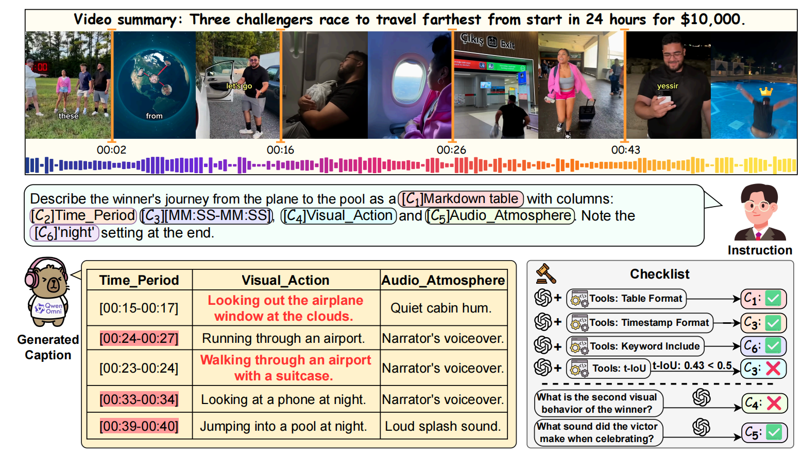

# **OmniCap-IF: Benchmarking and Improving Instruction Following Abilities for Omni-Video Captioning**

[](https://nju-link.github.io/OmniCap-IF/)
&nbsp;
[](https://arxiv.org/abs/2606.xxxxx)
&nbsp;
[](https://huggingface.co/NJU-LINK/OmniCaptioner-IF-7B)
&nbsp;
[](https://huggingface.co/NJU-LINK/OmniCaptioner-IF-3B)
&nbsp;
[](https://huggingface.co/datasets/NJU-LINK/OmniCap-IF-54K)
&nbsp;
[](https://huggingface.co/datasets/NJU-LINK/OmniCap-IF)

## Overview

**OmniCap-IF** targets instruction-following in omni-modal video captioning, where models must not only understand visual and audio streams, but also obey complex user-specified structural, stylistic, temporal, visual, audio, and audio-visual constraints. We introduce the OmniCap-IF benchmark for fine-grained checklist-based evaluation, construct the OmniCap-IF-54K instruction-tuning dataset, and train the OmniCaptioner-IF model family to improve controllable omni-video captioning.

<p align="center">
  
</p>

---

## Quick Start

### Clone

```bash
git clone https://github.com/NJU-LINK/OmniCap-IF.git
cd OmniCap-IF
```

### Installation

```bash
conda create -n omnicap_if python=3.12
conda activate omnicap_if
pip install torch torchvision
pip install transformers==4.57.1
pip install accelerate
pip install flash-attn --no-build-isolation
pip install qwen-omni-utils[decord] -U
```

### Model Usage

```python
import torch
from transformers import Qwen2_5OmniForConditionalGeneration, Qwen2_5OmniProcessor
from qwen_omni_utils import process_mm_info

MODEL_ID = "NJU-LINK/OmniCaptioner-IF-7B"
VIDEO_PATH = "example_video.mp4"
INSTRUCTION = (
    "Please describe this video in a Markdown table with columns "
    "'Timestamp', 'Visual Action', and 'Audio Content'. Include precise timestamps "
    "and mention the key audio-visual events."
)

MAX_PIXELS = 297920
VIDEO_MAX_PIXELS = 297920

model = Qwen2_5OmniForConditionalGeneration.from_pretrained(
    MODEL_ID,
    torch_dtype=torch.bfloat16,
    device_map="cuda",
    attn_implementation="flash_attention_2"
)
processor = Qwen2_5OmniProcessor.from_pretrained(MODEL_ID)
model.disable_talker()

conversation = [
    {
        "role": "user",
        "content": [
            {"type": "text", "text": INSTRUCTION},
            {
                "type": "video",
                "video": VIDEO_PATH,
                "max_pixels": MAX_PIXELS,
                "max_frames": 160,
                "fps": 1.0,
                "video_max_pixels": VIDEO_MAX_PIXELS
            }
        ],
    },
]

text = processor.apply_chat_template(conversation, add_generation_prompt=True, tokenize=False)
audios, images, videos = process_mm_info(conversation, use_audio_in_video=True)

inputs = processor(
    text=text,
    audio=audios,
    images=images,
    videos=videos,
    return_tensors="pt",
    padding=True,
    use_audio_in_video=True
)
inputs = inputs.to(model.device).to(model.dtype)

with torch.inference_mode():
    text_ids = model.generate(
        **inputs,
        use_audio_in_video=True,
        return_audio=False,
        thinker_max_new_tokens=1536,
        talker_max_tokens=1536
    )

response = processor.decode(text_ids[0][inputs.input_ids[0].size(0):], skip_special_tokens=True)
print(response)
```

---

## Evaluation on OmniCap-IF

### Installation

```bash
pip install openai google-genai tqdm pandas openpyxl
```

### Download Benchmark

Download the OmniCap-IF testset from Hugging Face:

```bash
hf download NJU-LINK/OmniCap-IF --repo-type dataset --local-dir OmniCap-IF-testset
```

### Prepare Model Responses

Each evaluated model should be organized as a single JSON file under `response/`:

```text
response/
  YourModel.json
```

The JSON file maps each video id to a list of prompt-level responses:

```json
{
  "001": [
    {
      "field": "For Understanding",
      "prompt_id": "01",
      "response": "The model response for prompt 01."
    },
    {
      "field": "For Generation",
      "prompt_id": "02",
      "response": "The model response for prompt 02."
    },
    {
      "field": "For Retrieval",
      "prompt_id": "03",
      "response": "The model response for prompt 03."
    },
    {
      "field": "For Communication",
      "prompt_id": "04",
      "response": "The model response for prompt 04."
    }
  ],
  "002": [
    {
      "field": "For Understanding",
      "prompt_id": "01",
      "response": "The model response for another video."
    }
  ]
}
```

### Run Evaluation

```bash
export JUDGE_API_KEY=YOUR_KEY
export JUDGE_MODEL=gpt-5-mini

python generate_check_result.py \
  --models YourModel \
  --meta_dir ./annotation \
  --response_dir ./response \
  --output_dir ./check_result

python metrics.py --models YourModel
```

---

## License

Our dataset is under the CC-BY-NC-SA-4.0 license.

---

## Citation

```bibtex
@article{wang2026omnicapif,
  title   = {OmniCap-IF: Benchmarking and Improving Instruction Following Abilities for Omni-Video Captioning},
  author  = {Wang, Jiahao and Ping, An and Wang, Yanghai and Zhang, Yuanxing and Li, Shihao and Bian, Hanyan and Ren, Yichi and Zhang, Yize and Wang, Han and Chen, Haowen and Li, Junze and Wang, Jiaqi and Hu, Yiyang and Xu, Zhuze and Zhang, Zijie and Liu, Jiaheng},
  journal = {Preprint},
  year    = {2026}
}
```
